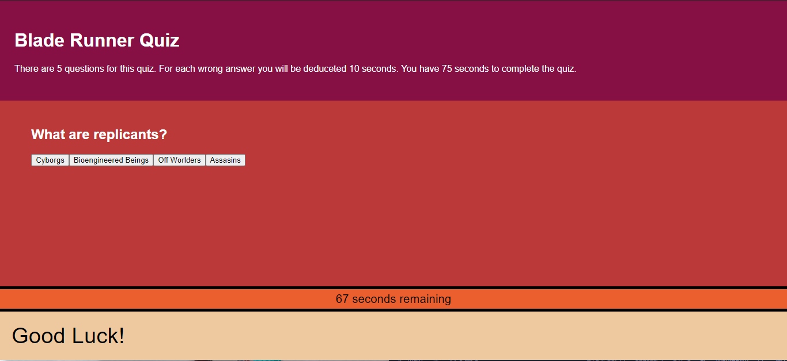

# Blade Runner Code Quiz
URL to this repository https://github.com/LifeInvaderr/CodeQuiz

URL to the deployed repository https://github.com/LifeInvaderr/CodeQuiz

## Description
With Blade Runner quiz, the user is given a series of questions to answer under a time limit. If the user answers a questions incorrectly the user will be deducted 10 seconds from the timer. 

## Table of Contents
* [Technologies](#technologies)
* [Installation](#installation)
* [Usage](#usage)
* [Future](#future)
* [Questions](#questions)

## Technologies
* Javascript
* HTML5
* CSS

## Installation
To install this repository, please either clone or install the zip version.

## Usage
With this code quiz, refactoring the code to introduce more or a different series of questions will be useful in creating new and unique quizzes

## Future
With this project, I plan on refactoring the code to develop a more polished project.

From both the aesthetic standpoint to the javascript code.

## Questions
For any questions or concerns, please email me at matthewkausfox@gmail.com

Thank you!